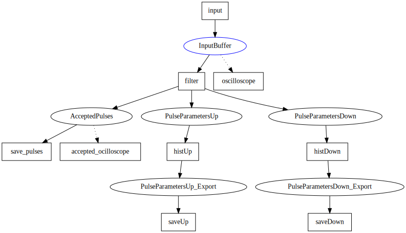

# Properties of cosmic muons
This example is inspired by the [Properties of cosmic muons](docs/experiment.pdf) experiment in the physics lab courses at KIT.

The specially designed functions are input and filter. The input simulates events similar to those of the real experiment and the filter analyzes those events.