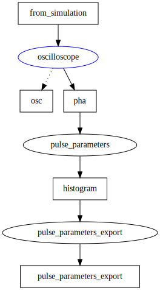

# Redpitaya-Spectroscopy
This example shows how the RedPitaya can be used as a tool for $\gamma$-spectroscopy. 

Events recorded by the RedPitaya or simulated are inserted into the oscilloscope buffer. The pha ([scipy.signal.find_peaks](https://docs.scipy.org/doc/scipy/reference/generated/scipy.signal.find_peaks.html)) analyzes the oscilloscope and calculates the requested pulse parameters. These are histogrammed and exportet.
An oscilloscope is used to spy on the pulses generated.

Different [spectra](spectra/README.md) are used to simulate simple pulses.

The application to use the RedPitaya as a fast Oscillosopce is stil under developement.